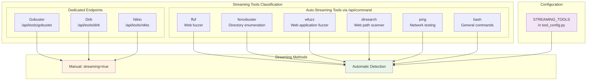
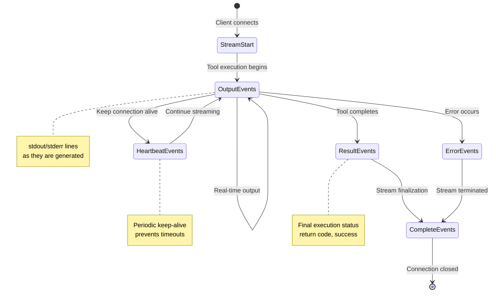
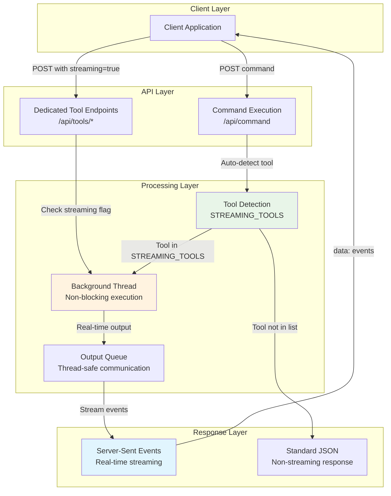
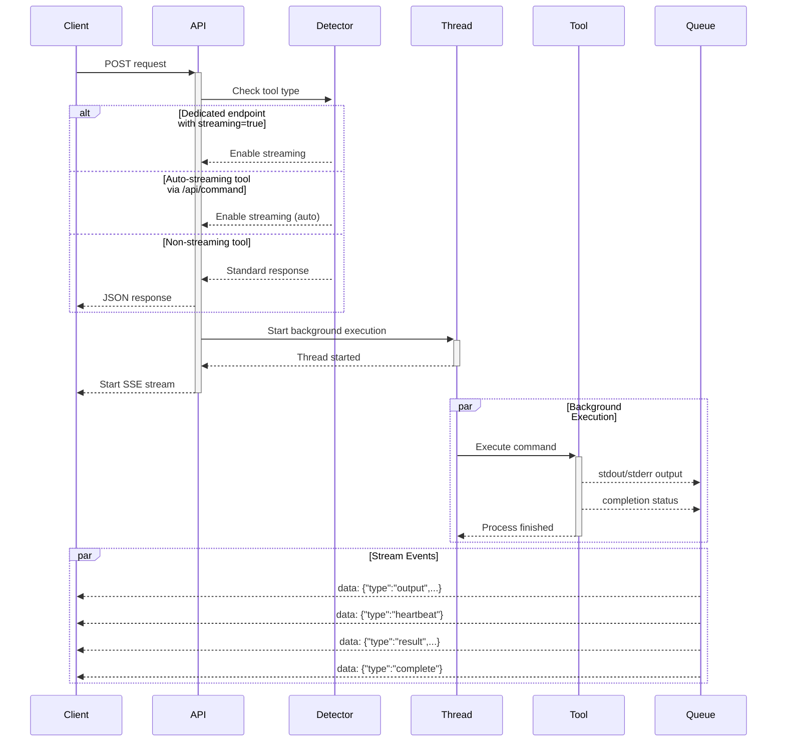

# Streaming Support for Kali Tools

## Overview

The MCP Kali Server now supports real-time streaming for penetration testing tools, allowing clients to receive output as it's generated rather than waiting for the complete scan to finish.

## Supported Tools

The following tools support streaming output:



### Tools with Dedicated Endpoints
- **Gobuster** (`/api/tools/gobuster`)
- **Dirb** (`/api/tools/dirb`) 
- **Nikto** (`/api/tools/nikto`)

### Tools via Command Execution Endpoint
These tools automatically enable streaming when executed via `/api/command`:

- **ffuf** - Web fuzzer
- **feroxbuster** - Fast directory/file enumeration tool
- **wfuzz** - Web application fuzzer
- **dirsearch** - Web path scanner
- **ping** - Network connectivity testing
- **bash** - General bash commands (useful for testing)

All tools listed above will automatically stream their output in real-time when executed through either their dedicated endpoints or the general command execution endpoint.

## How to Enable Streaming

### For Tools with Dedicated Endpoints

To enable streaming for tools with dedicated endpoints (Gobuster, Dirb, Nikto), add the `streaming: true` parameter to your request:

```json
{
    "url": "http://example.com",
    "mode": "dir",
    "wordlist": "/usr/share/wordlists/dirb/common.txt",
    "streaming": true
}
```

### For Tools via Command Execution

For tools in the STREAMING_TOOLS list, streaming is **automatically enabled** when using the `/api/command` endpoint. No additional parameter is needed:

```json
{
    "command": "ffuf -u http://example.com/FUZZ -w /usr/share/wordlists/dirb/common.txt"
}
```

```json
{
    "command": "feroxbuster -u http://example.com -w /usr/share/wordlists/dirb/common.txt"
}
```

The system automatically detects these tools and enables streaming based on the tool configuration in `STREAMING_TOOLS`.

## Streaming Response Format

When streaming is enabled, the endpoint returns a Server-Sent Events (SSE) stream instead of a JSON response. The response has the following format:

### Content Type
```
Content-Type: text/plain; charset=utf-8
Cache-Control: no-cache
Connection: keep-alive
```

### Event Types Flow



### Event Types

1. **Output Events** - Real-time command output
   ```
   data: {"type": "output", "source": "stdout", "line": "Found: /admin"}
   ```

2. **Heartbeat Events** - Keep connection alive
   ```
   data: {"type": "heartbeat"}
   ```

3. **Result Events** - Final execution result
   ```
   data: {"type": "result", "success": true, "return_code": 0}
   ```

4. **Error Events** - Error information
   ```
   data: {"type": "error", "message": "Server error: Connection refused"}
   ```

5. **Complete Events** - Indicates stream end
   ```
   data: {"type": "complete"}
   ```

## Streaming Architecture



## Streaming Flow



## Benefits

1. **Real-time feedback** - See results as they're discovered
2. **Long-running scans** - No timeout issues for lengthy operations
3. **Progressive results** - Start analyzing results before scan completion
4. **Resource efficiency** - Lower memory usage compared to buffering all output

## Compatibility

- **Non-streaming mode** remains available by omitting the `streaming` parameter or setting it to `false`
- **Backward compatibility** - Existing clients continue to work without changes
- **Fallback behavior** - If streaming fails, the endpoint falls back to standard JSON response

## Implementation Details

The streaming implementation uses:
- **Threading** - Commands run in separate threads to prevent blocking
- **Queue-based communication** - Thread-safe output collection
- **Flask streaming** - Server-Sent Events via `stream_with_context`
- **Error handling** - Comprehensive error recovery and reporting
- **Auto-detection** - Tools in `STREAMING_TOOLS` list automatically enable streaming
- **Tool configuration** - Centralized configuration in `tool_config.py` manages streaming behavior

### Streaming Tool Detection

The system automatically detects streaming tools based on the `STREAMING_TOOLS` configuration:

```python
# From tool_config.py
STREAMING_TOOLS = [
    "ffuf",
    "gobuster", 
    "feroxbuster",
    "wfuzz",
    "dirsearch",
    "dirb",
    "nikto",
    "ping",
    "bash"
]
```

When any of these tools are executed via `/api/command`, streaming is automatically enabled regardless of any streaming parameter.

## Troubleshooting

### Common Issues

1. **Connection drops** - Check network stability and firewall settings
2. **Missing heartbeats** - Verify client timeout configurations
3. **Incomplete streams** - Ensure proper error handling in client code

### Debug Mode

Enable debug logging in the Kali server configuration to see detailed streaming operations:

```python
LOGGING_LEVEL = "DEBUG"
```

This will show:
- Stream setup and teardown
- Thread lifecycle management
- Queue operations
- Error conditions
